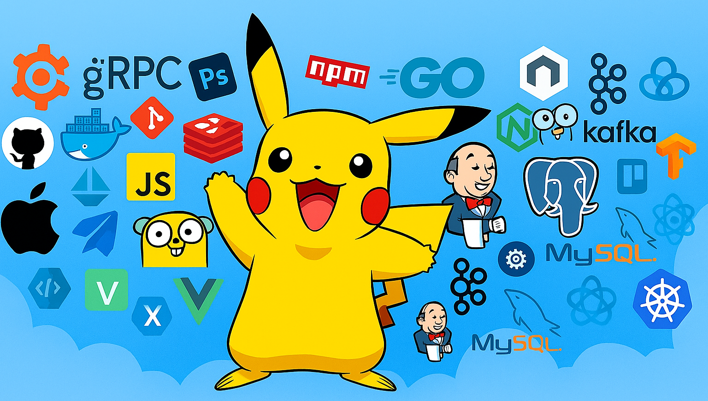

<!-- ===================== PROFILE BANNER / DISPLAY IMAGE ===================== -->

  

<!-- ===================== TYPING INTRO HEADING ===================== -->
<h1 align="center">
  

      <!-- Typing SVG Animation -->
    
    <!-- Waving Hand GIF -->
    
  

</h1>

<!-- ===================== TAGLINE / MOTTO ===================== -->

  <em>
    › Love to write <b>code</b> that makes <b>sense</b> — to <b>humans</b> first
  </em>

<!-- ===================== DIVIDER ANIMATION ===================== -->

<!-- ===================== SHORT INTRO ===================== -->

  <em>
    This is <b>Subham Kolay</b>, a <b>BTech Computer Science</b> undergraduate from  
    <a href="https://www.hetc.ac.in/"><b>Hooghly Engineering & Technology College, West Bengal</b></a>
    
  </em>

<!-- ===================== PERSONAL DESCRIPTION ===================== -->

  <em>
    A curious <b>web developer in the making</b>, passionate about building  
    <b>clean</b> and <b>meaningful</b> web applications, while strengthening  
    <b>problem-solving skills</b>. 
    I enjoy learning <b>new technologies</b>, collaborating with others, and  
    exploring ideas through <b>hands-on projects</b> and <b>hackathons</b>.
  </em>

<!-- ===================== LEARNING PHILOSOPHY ===================== -->

  <em>
    Learning steadily — with <b>patience</b>, <b>curiosity</b>, and <b>consistency</b>.
  </em>
  

<!-- ===================== DIVIDER ANIMATION ===================== -->

<!-- ===================== ABOUT ME SECTION ===================== -->

  <h1>
    𝐀 𝐟𝐞𝐰 𝐭𝐡𝐢𝐧𝐠𝐬 𝐚𝐛𝐨𝐮𝐭 𝐦𝐞
    
  </h1>
  <!-- Right-side animated coder GIF -->
  

  👨🏻‍💻 <b>About me:</b> Exploring the world of <b>Full Stack Web Development</b> 

  🎓 <b>Education:</b> Pursuing <b>BTech CSE (2023–2027)</b> 

  🌱 <b>Currently focused on:</b> The <b>MERN Stack</b> and core web fundamentals 

  🤝 <b>Collaboration:</b> Love working on <b>beginner-friendly</b> and  
  <b>learning-oriented</b> projects 

  💡 <b>Hobbies:</b> Chess ♟️, Guitar 🎸, Drawing ✏️, and <b>creative exploration</b>

 

<!-- ===================== DIVIDER ANIMATION ===================== -->

<!-- ===================== TECH STACK HEADER ===================== -->

   

<table align="center">
  <tr>
    <td><b>💻 Programming Languages</b></td>
    <td>
      
    </td>
  </tr>

  <tr>
    <td><b>🌐 Web Technologies</b></td>
    <td>
      
    </td>
  </tr>

  <tr>
    <td><b>⚙️ Frameworks / Libraries</b></td>
    <td>
      
    </td>
  </tr>

  <tr>
    <td><b>🗄️ Database</b></td>
    <td>
      
    </td>
  </tr>

  <tr>
    <td><b>🛠️ Tools</b></td>
    <td>
      
    </td>
  </tr>

  <tr>
    <td><b>🖥️ Operating System</b></td>
    <td>
      
    </td>
  </tr>
</table>
 

<!-- ===================== DIVIDER ANIMATION ===================== -->

###  **GitHub Statistics**

<!-- ===================== GITHUB STATISTICS SECTION ===================== -->

  <!-- GitHub Stats & Streak --> 
  <table width="100%">
    <tr>
      <td align="center">
        
      </td>
      <td align="center">
        
      </td>
    </tr>
  </table>

   

  <!-- Profile Summary Card-->
  

 

<!-- ===================== CONTRIBUTION SNAKE ===================== -->

  <h3>🐍 My Snake is Hungry!</h3>
  <picture>
    <source media="(prefers-color-scheme: dark)"
      srcset="https://raw.githubusercontent.com/TechSuvo108/TechSuvo108/output/github-contribution-grid-snake-dark.svg" />
    <source media="(prefers-color-scheme: light)"
      srcset="https://raw.githubusercontent.com/TechSuvo108/TechSuvo108/output/github-contribution-grid-snake.svg" />
    
  </picture>

 

<!-- ===================== DIVIDER ANIMATION ===================== -->

<!-- ===================== CONNECT WITH ME ===================== -->
### 🌐 **Connect with Me**
  <!-- Social Media & Contact Links -->

  
  
  
  
  

 

<!-- ===================== DEVELOPER QUOTE SECTION ===================== -->

  <h2 style="display: inline; margin: 0 5px;">
    
    𝐃𝐞𝐯𝐞𝐥𝐨𝐩𝐞𝐫’s <em>𝐖𝐢𝐬𝐝𝐨𝐦 & 𝐈𝐧𝐬𝐢𝐠𝐡𝐭</em>
  </h2>

 

<!-- ===================== QUOTE CARD ===================== -->

  <blockquote
    style="
      background: linear-gradient(135deg, #0f0c29, #302b63, #24243e);
      padding: 30px;
      border-radius: 14px;
      max-width: 900px;
      box-shadow: 0 0 20px rgba(0,0,0,0.4);
    "
  >
    

      “
      Any fool can write code that a computer can understand.
      Good programmers write code that humans can understand.
      ”
      

      — Martin Fowler
    

    

  </blockquote>

 

<!-- ===================== SUPPORT SECTION ===================== -->

  <h2>
    🚀 𝐒𝐮𝐩𝐩𝐨𝐫𝐭 𝐌𝐲 𝐂𝐨𝐝𝐢𝐧𝐠 𝐉𝐨𝐮𝐫𝐧𝐞𝐲
  </h2>
  
  

    <em>
      If my projects help you <b>learn</b>, <b>explore</b>, or <b>grow</b> as a developer, 
      your support gently <b>encourages</b> me to keep <b>building</b> and <b>learning</b> in public.
    </em>
  

<!-- Left-aligned Support Button (UNCHANGED) -->

   
  
    

<!-- Right-aligned encouragement (rewritten style only) -->
<h3 align="right">
  ⭐ <em>Every star means a lot — it keeps the motivation alive.</em>
</h3>

<!-- Footer Image (UNCHANGED) -->

<!-- ===================== FOOTER WAVE ANIMATION ===================== -->

